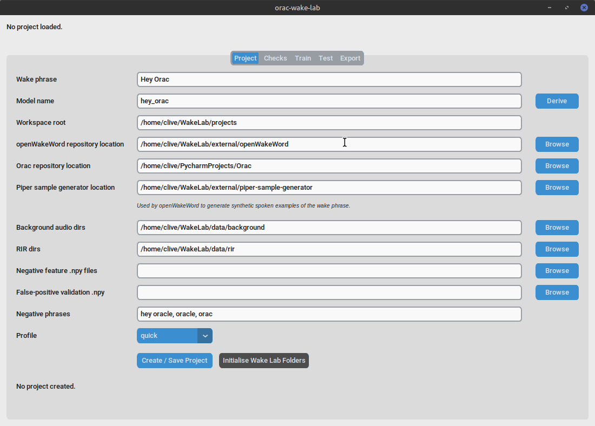
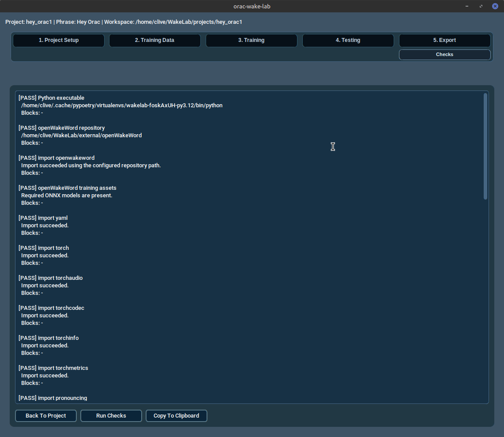
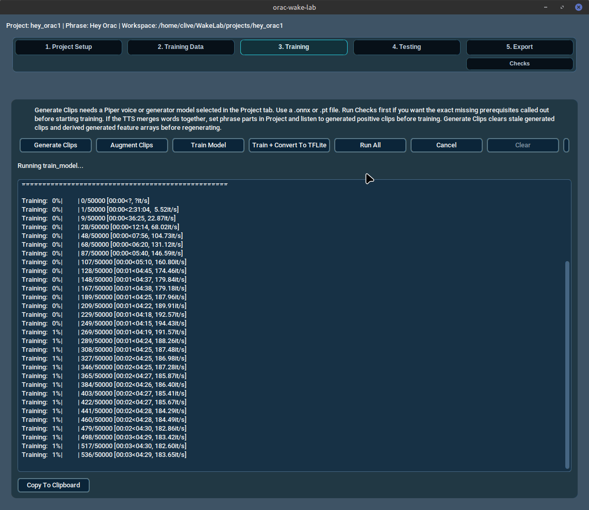
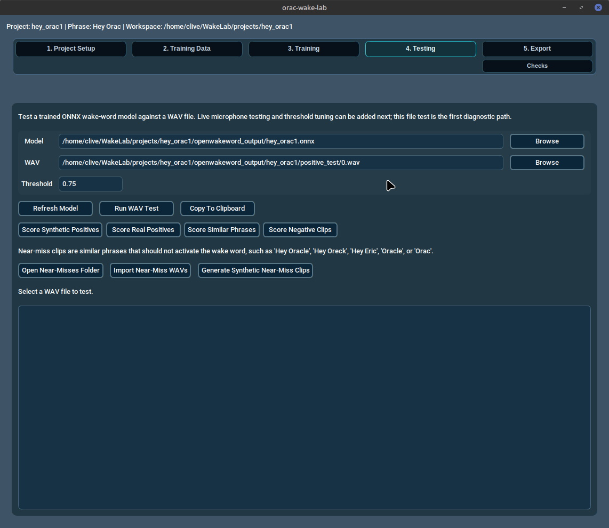
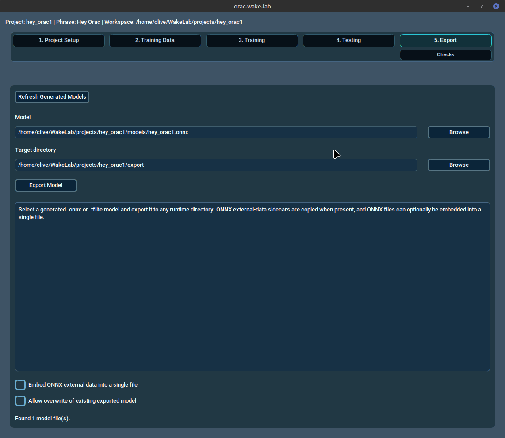

# Wake Lab

Wake Lab is a standalone training and workbench application for
openWakeWord. It helps you prepare, train, test, and export custom
wake-word models.

Wake Lab does not train a wake word by itself. Instead, it helps you:

- create a per-project workspace
- generate openWakeWord training configuration
- run openWakeWord training stages
- capture training logs
- mirror generated model artefacts into the project workspace
- export candidate models to a chosen runtime directory

It is a desktop developer tool for local wake-word model development.

## Launch

From the WakeLab repository root:

```bash
poetry env use python3.12
poetry install --with test
poetry run wakelab
```

The UI requires a graphical session and `customtkinter`.

You can also use the launcher script when working from the repository
checkout:

```bash
bin/wakelab.sh
bin/wakelab.sh --list-themes
bin/wakelab.sh --set-theme Phoenix --appearance dark
bin/wakelab.sh --appearance light
```

`--list-themes` prints the implemented theme names. `--set-theme`
accepts a theme name with or without `.json`. `--appearance` accepts
`dark` or `light`. The launcher writes the selected display settings to
`src/orac_wake_lab/themes/set_theme.txt` in this format:

```text
<theme-name>:<mode>
```

For example:

```text
Phoenix:Dark
```

## Overview

Wake Lab is a convenience layer around the openWakeWord training
workflow. It does not implement wake-word training logic itself. The
application:

- stores project settings in a local workspace
- validates local paths and dependencies
- writes the training configuration expected by openWakeWord
- launches the openWakeWord training stages as subprocesses
- mirrors generated `.onnx` or `.tflite` artefacts into the project
  workspace
- exports selected model files to a chosen runtime directory

## Concepts

These terms are specific to the Wake Lab workflow.

- **Wake phrase**: the phrase you want the wake-word model to respond
  to, for example `Hey Nova`.
- **Model name**: the filesystem-safe name derived from the wake phrase
  and used for workspace and model files, for example `hey_nova`.
- **openWakeWord repository path**: the root of a local cloned
  openWakeWord checkout. Wake Lab expects a repository layout that
  contains `openwakeword/train.py`.
- **Piper sample generator path**: the root of a local
  `piper-sample-generator` checkout. Wake Lab expects this path to
  contain `generate_samples.py`.
- **Piper voice/model**: the Piper voice assets used by openWakeWord to
  synthesise spoken examples of the wake phrase during training.
- **Training pronunciation phrase**: optional text used only for positive
  TTS sample generation. It does not rename the model or replace the
  canonical wake phrase.
- **Training phrase parts**: optional `|`-separated phrase fragments such
  as `Hey | Nova`. Wake Lab can synthesize each part separately and
  concatenate the fragments with real silence between them.
- **Background audio**: directories containing ambient audio to mix into
  generated training samples.
- **Room impulse responses, RIR**: recordings of room acoustics used to
  make training samples sound more like real microphone capture.
- **Negative feature `.npy` files**: the standard bundle of preprocessed
  feature arrays that teach openWakeWord what normal background speech,
  noise, and music look like. Wake Lab expects these files to already
  exist and points training at them.
- **False-positive validation `.npy` file**: the preprocessed feature
  file used to check how often the model triggers when it should not.
  Wake Lab expects this to already exist as a `.npy` file, not as a raw
  audio clip.
- **ONNX model**: an exported model format that Wake Lab can copy into
  a runtime directory.
- **TFLite model**: an alternative exported model format that Wake Lab
  can also copy into a runtime directory.
- **Threshold**: the activation threshold used when evaluating whether
  the exported wake-word model activates.

## What are .npy feature files?

`.npy` files are NumPy binary data files. In Wake Lab, they are not
audio recordings. They are numerical arrays created by preprocessing
audio first, and openWakeWord uses those arrays during training.

The practical difference is:

- Raw audio files such as `.wav`, `.mp3`, and `.flac` contain sound.
- Preprocessed `.npy` feature files contain numbers derived from that
  sound after feature extraction.

Wake Lab currently expects those `.npy` files to already exist. You
normally do not open or edit them manually. Instead, you point Wake Lab
at the files produced by the training or preprocessing workflow.

## Feature bundle bootstrap

Wake Lab ships with a first-run workflow for the standard openWakeWord
feature bundle so you do not need to chase down feature files by hand.
The bundle lives in the managed WakeLab home under:

- `~/WakeLab/data/features/negative/openwakeword_features_ACAV100M_2000_hrs_16bit.npy`
- `~/WakeLab/data/features/validation/validation_set_features.npy`

These are `.npy` files, not audio recordings. The negative file is the
large one, about 17 GB, and the validation file is much smaller.

On the **Project** tab, Wake Lab can:

- Detect Feature Bundle: check whether the managed files are already in
  place and use them automatically
- Register Existing Feature Bundle: copy files you already have into the
  managed WakeLab folders
- Open Feature Folder: open the managed feature directory in your file
  manager
- Download Standard Feature Bundle: fetch the official bundle from
  `davidscripka/openwakeword_features` on Hugging Face

Simple mode uses the managed bundle automatically when it is present.
Advanced users can still browse to their own `.npy` files and override
the managed locations manually.

## Prerequisites

Separate the prerequisites into two groups:

### UI prerequisites

These are needed to launch the Wake Lab window.

- Linux desktop session
- WakeLab repository checkout
- Python 3.12+ environment
- `customtkinter`

The UI should still be launchable even when the training inputs are not
ready. Missing training data should block training tabs, not the app
itself.

### Training prerequisites

These are needed for a useful training run.

- openWakeWord repository checkout cloned locally
- openWakeWord training dependencies
- Piper sample generator repository cloned locally
- Piper voice or generator model
- background audio directories
- RIR directories
- negative feature `.npy` files
- false-positive validation `.npy` file

The app does not download datasets for you.

Example clone commands:

```bash
mkdir -p ~/WakeLab/external
cd ~/WakeLab/external
git clone https://github.com/dscripka/openWakeWord
git clone https://github.com/rhasspy/piper-sample-generator
```

### Where to clone openWakeWord

Use one managed openWakeWord checkout by default:

```text
~/WakeLab/external/openWakeWord/
```

That directory should contain:

```text
~/WakeLab/external/openWakeWord/openwakeword/train.py
```

Do **not** clone openWakeWord into an individual project workspace such
as `~/WakeLab/projects/<model_name>/`. Project workspaces are for
project settings, generated clips, logs, mirrored models, real positives,
and export output. The project-local `openwakeword_output/` directory is
generated training output, not the openWakeWord source repository.

The **openWakeWord checkout** field in Advanced Infrastructure Settings
points to the repository root. Advanced users can point that field at a
different checkout, but only one checkout path is active for a saved
project.

## What is the Piper generator path?

The Piper generator path is the location of the `piper-sample-generator`
repository clone that openWakeWord uses to synthesise training clips.

Current Wake Lab behaviour expects the configured path to point at the
root of a cloned repository that contains `generate_samples.py`. The
dependency check code prepends that directory to `sys.path`, imports
`generate_samples`, and confirms that the module exposes a
`generate_samples()` function.

In practical terms, this means the field should usually point to the
repository root of a cloned checkout, not to an installed package
directory.

Example verification:

```bash
test -f /path/to/piper-sample-generator/generate_samples.py
```

or, if you prefer to check from Python:

```bash
python - <<'PY'
from pathlib import Path
path = Path("/path/to/piper-sample-generator")
print((path / "generate_samples.py").exists())
PY
```

The openWakeWord notebook and training example both follow this style of
workflow by referring to a local `piper-sample-generator` checkout.

## Where do Piper voice models go?

The Piper sample generator needs a Piper voice model before WakeLab can
generate synthetic positive clips. WakeLab does not currently download
Piper voices for you.

Download a Piper voice from the `rhasspy/piper-voices` repository on
Hugging Face. A usable voice is normally a matching pair of files:

- `<voice-name>.onnx`
- `<voice-name>.onnx.json`

Keep those files together. The recommended managed location is:

```text
~/WakeLab/external/piper-voices/
```

For example:

```text
~/WakeLab/external/piper-voices/en_US-lessac-medium.onnx
~/WakeLab/external/piper-voices/en_US-lessac-medium.onnx.json
```

In the Project tab, set **Voice / generator model** to the `.onnx` file.
The matching `.onnx.json` file should sit beside it with the same base
name. The **Piper generator** field is different: it should point to the
`~/WakeLab/external/piper-sample-generator/` repository checkout, not to
the voice model file.

Source for Piper voices:
`https://huggingface.co/rhasspy/piper-voices/tree/v1.0.0`

### Known limitation

Wake Lab currently validates the path by looking for
`generate_samples.py` and importing `generate_samples` from that
directory. If your local Piper layout differs, the app will treat it as
unusable.

## Managed Wake Lab home

Wake Lab treats `~/WakeLab` as a managed home directory for
conventional locations. You can override this location by setting the
environment variable:

```bash
export WAKE_LAB_HOME=/path/to/your/custom/home
```

Within the Wake Lab home, the following conventional layout is used:

```text
~/WakeLab/
  projects/               # Individual wake-word project workspaces
  data/
    background/           # Ambient audio recordings for augmentation
    rir/                  # Room Impulse Response files
    features/
      negative/           # Precomputed negative feature .npy files
      validation/         # False-positive validation .npy files
  external/
    openWakeWord/         # Local openWakeWord repository checkout
    piper-sample-generator/ # Local piper-sample-generator checkout
    piper-voices/         # Downloaded Piper .onnx voice files
  downloads/              # Temporary download location
  cache/                  # Application cache
```

### Initialise WakeLab folders

You can automatically create this directory structure from the **Project**
tab by clicking **Initialise WakeLab Folders**.

This action only creates the empty directories. It does not:
- clone repositories
- download datasets
- download feature files
- modify any runtime application configuration

Empty managed folders are expected until you supply the corresponding
training data or external tools.

## Simple mode versus advanced mode

Wake Lab defaults simplify where things live by pre-filling paths and
discovering files within the managed home directory.

- **Simple mode**: Follow the managed conventions. Put your data and
  tools in `~/WakeLab` and the app will auto-fill most fields.
- **Advanced mode**: Override any path in the **Project** tab. You can
  point to data anywhere on your filesystem.

Once a final model is exported, the target runtime only needs the model
file and whatever configuration that runtime requires. The training data
and project workspaces are only needed for retraining or audit.

## What is temporary?

- **Downloads**: Files in `~/WakeLab/downloads` can be deleted after
  extraction.
- **Cache**: `~/WakeLab/cache` is for temporary application state.
- **Project logs**: `logs/` inside a project workspace are for debugging
  training.

## What is required at runtime?

Most runtimes only require the final exported wake-word model, usually a
`.tflite` or `.onnx` file, plus their own wake-word configuration.

You do **not** need the following at runtime:
- `openWakeWord` repository
- `piper-sample-generator` repository
- background audio or RIR datasets
- negative feature files
- Wake Lab project workspaces

## What should be kept for retraining?

To retrain or fine-tune a model later, you should keep:
- the project workspace (especially `project.json`)
- the exact datasets (background, RIR) used
- the negative feature files used

Retaining these ensures that your next training run is consistent with
the previous one.

## First-run checklist

From a fresh checkout:

1. Confirm you have a Python 3.12+ environment.
2. Initialise and install dependencies with Poetry:

   ```bash
   poetry env use python3.12
   poetry install --with test
   ```

3. Launch the app:

   ```bash
   poetry run wakelab
   ```

4. In the **Project** tab, click **Initialise WakeLab Folders**.
5. Supply your training data (background, RIR, features) to the newly
   created folders under `~/WakeLab/data/`. The `negative/` and
   `validation/` feature folders expect `.npy` files, not ordinary audio
   recordings. For a first run, use the feature-bundle actions in the
   **Project** tab rather than hunting for files manually.
6. Clone the external tools if missing:
   ```bash
   cd ~/WakeLab/external
   git clone https://github.com/dscripka/openWakeWord
   git clone https://github.com/rhasspy/piper-sample-generator
   ```
7. Download a Piper voice model pair (`.onnx` and `.onnx.json`) into
   `~/WakeLab/external/piper-voices/`, then select the `.onnx` file in
   **Voice / generator model**.
8. Create or load a project in the **Project** tab. The app will
   pre-fill the managed paths for the data and tools you just supplied.
9. Run **Checks** to confirm the local training prerequisites.
10. Use **Train** to generate clips, augment, and train the model.
11. Use **Export** to copy the model to the runtime directory you want
    to test or deploy.

## Example workflow

This is an example workflow using the phrase `Hey Nova`. It is a guide
for moving through the app, not a guarantee that all training
prerequisites are already installed or that the resulting model will be
good simply because training completes.

1. Launch WakeLab from the WakeLab repository:

   ```bash
   export PYTHONPATH=src
   python -m orac_wake_lab.app
   ```

2. Use the workflow stepper to open **1. Project Setup** and create a
   new project.
3. Enter the wake phrase `Hey Nova`.
4. Confirm, or edit, the derived model name so it is `hey_nova`.
5. Set the openWakeWord repository path to your local checkout.
6. Set the Piper sample generator path to your local
   `piper-sample-generator` checkout.
7. Select the background audio directories, RIR directories, negative
   feature `.npy` files, and the false-positive validation `.npy` file.
8. Use the unnumbered **Checks** button under **5. Export** and review
   the results before training.
9. Use **Back To Project** if you need to return from Checks, then save
   the project if you changed any settings.
10. Open **3. Training** and run the stages in order:

    - Generate Clips
    - Augment Clips
    - Train Model
    - Train + Convert To TFLite

11. Review the log output if any stage fails. The logs should show which
    subprocess or dependency caused the problem.
12. Open **5. Export** and confirm that a generated `.onnx` or
    `.tflite` model has been detected.
13. Export the model to the runtime directory you want to test or deploy.
14. Configure your target runtime to load the exported model and chosen
    activation threshold.

This example only covers the mechanics of using the app. The exported
model still needs real-world testing for false positives and false
negatives before it should be treated as ready.

## Improving wake-word efficiency

Wake Lab improves a wake-word model by repeating a measure, adjust, and
retrain loop. In this context, efficiency means that the exported model
activates reliably when the wake phrase is spoken, while staying quiet on
near-misses, background speech, music, and room noise.

1. Start in the **Project** tab and open the existing wake-word project.
   Confirm that the wake phrase, model name, openWakeWord checkout, Piper
   sample generator checkout, and Piper voice/model are correct.
2. Improve the training inputs before retraining. Put realistic
   background audio from the places where the model will run into one or more
   folders, usually under the managed `~/WakeLab/data/background/`
   directory created by **Initialise WakeLab Folders**, then add those
   folders to the **Project** tab's **Background audio dirs** field. Add
   useful RIR room-response data, keep the standard negative feature
   bundle configured, and add negative phrases that sound close to the
   wake phrase but should not activate it.
3. For a serious retraining run, use the `balanced` profile instead of
   `quick`. Use `quick` for fast checks only.
4. Save the project so Wake Lab regenerates the training configuration.
5. Run **Checks** and fix every blocker before starting training.
6. In **Train**, run the stages in order:

   - Generate Clips
   - Augment Clips
   - Train Model
   - Train + Convert To TFLite, if a TFLite export is needed

7. In **4. Testing**, evaluate the generated ONNX model against known
   synthetic positives, imported real positives, near-miss clips,
   generated negative clips, and real non-wake-word recordings.
   Synthetic and real positive clips should activate. Near-misses,
   negative clips, and real non-wake-word recordings should stay below
   the selected threshold.
8. Tune the threshold from the **Test** tab results. If the model false-activates, raise the threshold or add
   stronger negative examples. If it misses the wake phrase, lower the
   threshold or improve the positive training coverage and acoustic
   realism.
9. Export the best model from **Export**, then configure and test it in
   your target runtime.
10. Repeat the loop with real failure examples. False positives should be
    added as negative coverage, and missed activations should guide
    better voice, background, RIR, or profile choices.

Retraining is required when the wake phrase changes. Threshold tuning is
usually the first thing to try when the phrase is unchanged and the model
is close to the desired behaviour.

## Tab guide

Each tab has a screenshot in [`assets/images/`](assets/images/).

The numbered workflow stepper is the primary navigation:

- **1. Project Setup**: opens the Project view and scrolls to the
  project setup section.
- **2. Training Data**: opens the Project view and scrolls to the
  training data section.
- **3. Training**: opens the training stage runner.
- **4. Testing**: opens model scoring and WAV diagnostics.
- **5. Export**: opens the model export tools.

**Checks** is a separate diagnostic utility, not a numbered workflow
stage. Use the unnumbered Checks button below the workflow stepper, then
use **Back To Project** to return to Project Setup.

### Project tab



This tab creates or updates a wake-word project workspace.

Widgets:

- **Wake phrase**: the phrase to train, for example `Hey Nova`.
- **Model name**: the filesystem-safe model identifier derived from the
  wake phrase.
- **Derive**: regenerates the model name from the wake phrase.
- **Workspace root**: top-level directory where Wake Lab stores the
  project workspace.
- **Piper sample generator location**: the local `piper-sample-generator` root.
- **Training pronunciation phrase**: optional alternate phrase used only
  while generating positive TTS clips.
- **Training phrase parts**: optional `|`-separated phrase fragments,
  for example `Hey | Nova`.
- **Inter-part silence min/max ms**: random silence bounds inserted
  between generated phrase parts. Defaults are `80` and `250`.
- **Background audio dirs**: comma-separated directories containing ambient
  audio for training.
- **RIR dirs**: comma-separated room impulse response directories.
- **Negative feature .npy files**: comma-separated feature files used
  for negative examples.
- **False-positive validation .npy**: the validation feature file.
- **Negative phrases**: extra phrases used as negative training text and
  as the source list for optional synthetic near-miss clips.
- **Profile**: training preset selector (`quick`, `balanced`, or
  `manual`).
- **Browse** buttons: pick directories or files for the corresponding
  fields.
- **Use imported real positives during training**: includes imported
  real wake-phrase recordings in positive training when enabled.
- **Minimum clips**: minimum number of imported real positive clips
  expected for real-positive training.
- **Real training mix**: slider controlling the target percentage of
  staged positive training clips that come from imported real positives.
- **Import Real Positive WAVs**: imports one or more real wake-phrase
  recordings into the project.
- **Open Real Positives Folder**: opens the project-local durable real
  positive clip directory.
- **Validate Real Positive Clips**: checks imported real positives for
  readable audio and suitable duration.
- **Save Project**: creates the workspace, writes project
  metadata, and generates the training config.
- **New Project**: clears the form for a new project without saving over
  the current form values.
- **Delete**: deletes the selected or active project workspace after
  confirmation.
- **Initialise WakeLab Folders**: creates the conventional managed
  directory structure under `~/WakeLab`.
- **Status**: shows validation messages and save confirmation.

### Checks tab



This tab runs local dependency and path validation for the active
project.

Widgets:

- **Run Checks**: executes the dependency checks in a background thread.
- **Back To Project**: returns to **1. Project Setup**.
- **Output textbox**: shows each validation result, its message, and the
  stage blocks it affects.

### Train tab



This tab launches the openWakeWord training stages.

Widgets:

- **Generate Clips**: clears the current model's generated raw clip
  folders and derived generated feature arrays, then runs the
  clip-generation stage.
- **Augment Clips**: runs the augmentation stage.
- **Train Model**: runs training without TFLite conversion.
- **Train + Convert To TFLite**: runs training and exports a TFLite
  model.
- **Run All**: runs the supported stages in sequence.
- **Cancel**: stops the current subprocess job.
- **Open Positive Clips**: opens
  `openwakeword_output/<model_name>/positive_train/` so you can listen to
  generated positives before augmenting or training.
- **Status label**: shows the active stage and job state.
- **Log textbox**: shows live subprocess output.

### Positive TTS word boundaries

Piper and `piper-sample-generator` may collapse word boundaries when a
wake phrase is generated as one utterance. Spaces and punctuation in text
do not guarantee audible pauses, so a phrase such as `Hey Nova` or
`Hay, O-rack` can become a merged sound like `hayurack`.

To control this, keep **Wake phrase** as the canonical phrase and
**Model name** as the exported model identifier, then set **Training
phrase parts** to the spoken pieces, for example `Hey | Nova`, and
enable **Use constructed parts**. When the toggle is off, Wake Lab uses
the single **Training pronunciation phrase** field instead. Wake Lab
generates each positive part separately and inserts a random real silence
duration between the configured min/max bounds, such as `80` to `250` ms.
The active mode controls which field group is required.

After **Generate Clips**, use **Open Positive Clips** and listen to the
generated positives before training. If the examples do not sound like
the intended spoken phrase, fix the pronunciation controls and regenerate
the clips before continuing.

### Test tab



This tab tests a trained ONNX wake-word model against a selected WAV
file. It is intended as the first diagnostic path before live microphone
testing: use it to confirm that the model activates on known positive
clips and stays below threshold on non-wake-word audio.

Near-miss clips are not defined by score. They are similar-sounding
phrases that should not activate the wake word, such as `Hey Nover`,
`Hey Nora`, `Hey Rover`, or `Nova`. After scoring, they should
ideally sit comfortably below threshold. Clips that sit just under
threshold are still risky and should be treated as weak negatives, not
successes.

Widgets:

- **Model**: path to the trained `.onnx` model. **Refresh Model**
  fills this from the current project, usually
  `openwakeword_output/<model_name>.onnx`.
- **Model Browse**: selects an ONNX model manually.
- **WAV**: path to the WAV file to evaluate.
- **WAV Browse**: selects a WAV file manually. Project-generated
  positive and negative clips are useful first test files.
- **Threshold**: score cutoff for reporting activation. The default is
  `0.75`.
- **Run WAV Test**: loads the model, runs the WAV through
  openWakeWord, and reports the highest score.
- **Copy To Clipboard**: copies the diagnostic output for support or
  comparison.
- **Score Synthetic Positives**: checks whether the model still
  activates on generated wake-word examples.
- **Score Real Positives**: checks whether the model activates on
  imported real user recordings of the wake phrase.
- **Score Similar Phrases**: checks whether near-miss phrases that
  should not activate the model stay below threshold.
- **Open Near-Misses Folder**: opens the folder where near-miss test
  clips live so you can inspect or manage them.
- **Import Near-Miss WAVs**: adds similar-sounding WAV clips to the
  near-miss test set.
- **Generate Synthetic Near-Miss Clips**: creates similar-sounding
  near-miss clips from the project’s negative phrases.
- **Score Negative Clips**: checks whether unrelated negative clips
  stay below threshold.
- **Output textbox**: shows the model path, WAV path, model output
  name, number of frames evaluated, maximum score, threshold, and
  activation result.

Typical checks:

1. Test one generated positive clip from
   `openwakeword_output/<model_name>/positive_train/`. The result should
   usually be `ACTIVATED`.
2. Test one generated negative clip from
   `openwakeword_output/<model_name>/negative_train/`. The maximum score
   should ideally stay below the threshold.
3. Test real recordings of your voice saying and not saying the wake
   phrase before relying on the model in a runtime environment.

### Real positive recordings

If a model scores generated Piper positives very highly but scores your
own recording of the same wake phrase near zero, the training and export
pipeline is working but the positive training data does not match your
voice. Pure synthetic training can miss your accent, timing, microphone,
room sound, or actual pronunciation. Lowering the threshold cannot fix a
near-zero score because there is no useful activation signal to tune.

Use **Import Real Positive WAVs** on the Project tab to select and add
multiple real user recordings at once. WakeLab stores the durable
originals in a dedicated project directory:

```text
<project_workspace>/real_positives/
```

Imported clips are normalised to mono 16 kHz 16-bit PCM WAV. WakeLab
keeps the existing Piper-generated positives and stages the real
positives as additional positive training clips before augmentation.
The **Real training mix** slider controls the staged positive-training
balance as a percentage. For example, `50%` produces roughly half
synthetic positives and half real positives; `100%` excludes synthetic
positive training clips for that diagnostic run and replaces that
training volume with real-derived staged copies.
Generated output cleanup may delete staged copies under
`openwakeword_output/`, but it does not delete the project-local
`real_positives/` recordings.

Record several natural examples of the wake phrase with the same
microphone and speaking style you expect to use. Fewer than 20 real
positive clips is useful for diagnosis but may still be too little for a
robust model.

### Export tab



This tab copies a trained model into a selected runtime directory.

Widgets:

- **Refresh Generated Models**: scans the project output directory for
  `.onnx` and `.tflite` files and mirrors them into the project model
  directory.
- **Model path entry**: the selected model file to export.
- **Browse**: opens a file picker for selecting a model manually.
- **Export Model**: copies the selected model into the selected target
  directory.
- **Output textbox**: shows the exported model path, generated config
  details, and any ONNX sidecar copied with it.
- **Allow overwrite of existing exported model**: permits replacing an
  existing target model after confirmation.
- **Status**: shows export status or failure messages.

## Exporting a model

The export tab copies a generated `.onnx` or `.tflite` model into the
target directory you choose. By default, WakeLab uses the project-local
export directory:

```text
<project_workspace>/export/
```

For ONNX models with external-data sidecars, WakeLab copies the sidecar
with the model unless you choose to embed the ONNX external data into a
single exported file.

Use that command to confirm the exported model activates correctly.

## Training caveats

- Changing the wake phrase means retraining.
- Threshold tuning is relatively cheap compared with retraining a new
  phrase.
- Training can take a long time.
- Dataset quality strongly affects false positives and false negatives.
- The app does not download datasets yet.
- The app does not edit runtime application configuration.
- Live microphone testing is Phase 2.

## Troubleshooting

### CustomTkinter missing

Install it into the active Python environment:

```bash
pip install customtkinter
```

### openWakeWord import fails

Check that the openWakeWord repository path points to a checkout that
contains `openwakeword/train.py`, and that the environment can import
`openwakeword` from that path.

### Piper generator path fails

Check that the path points to the root of a cloned
`piper-sample-generator` repository containing `generate_samples.py`.

### Negative feature `.npy` files missing

Add at least one precomputed negative feature file before running
training. The `Train` tab will block until one or more `.npy` files are
configured and readable.

### False-positive validation `.npy` missing

Provide a valid `.npy` validation feature file before training.

### TensorFlow / ONNX conversion dependency missing

Some stages and the TFLite conversion path depend on extra training
libraries. Run `Checks` to see which dependency is missing and which
training stage it blocks.

If you are using Poetry, you can install the conversion stack using:

```bash
poetry install --with conversion
```

Note: `onnx-tf` (required for TFLite conversion) may have compatibility
issues with some Python 3.12 environments due to its dependency on the
deprecated `tensorflow-addons` package.

### Model export target already exists

The export tab refuses to overwrite an existing exported model unless you
tick the overwrite box and confirm the replacement.

### Generated model not found

Use **Refresh Generated Models** after training, or confirm that the
openWakeWord output directory contains the expected `.onnx` or `.tflite`
file for your model name.

## Notes

- Wake Lab is a standalone local developer workflow for wake-word
  preparation and export.
