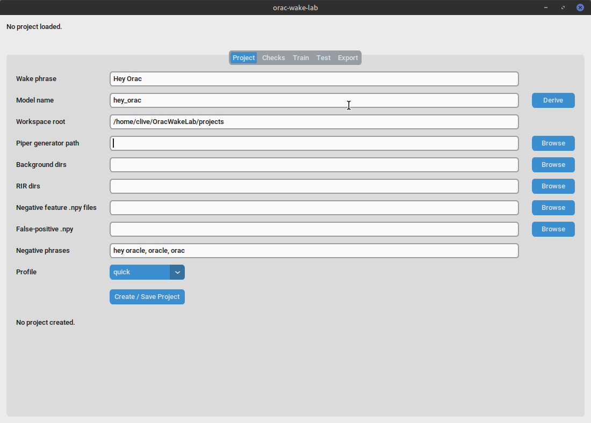
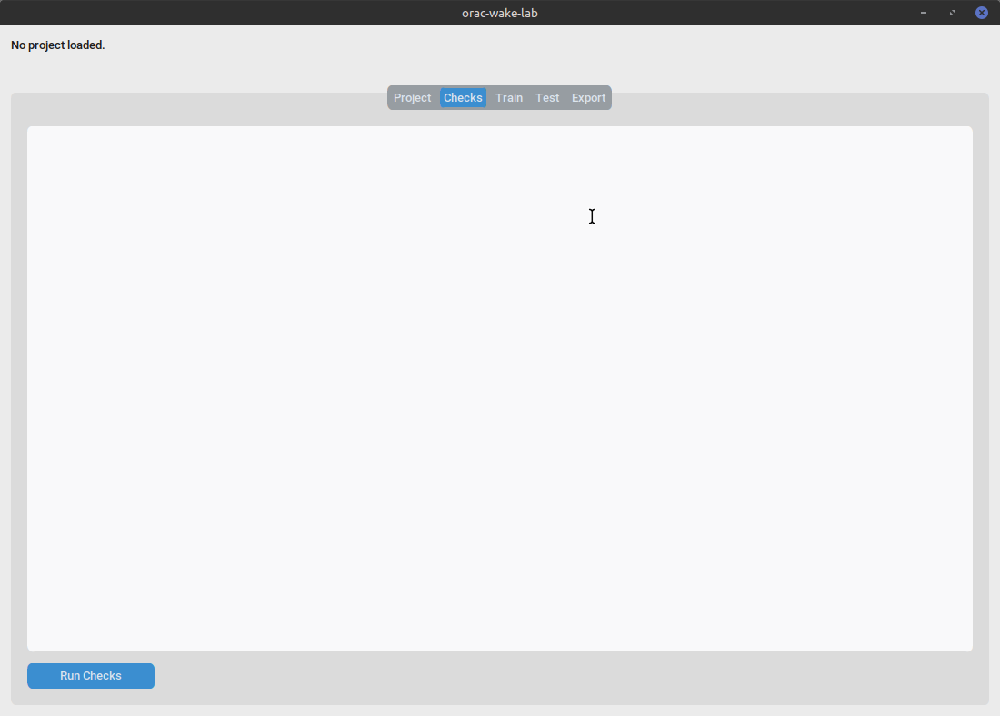
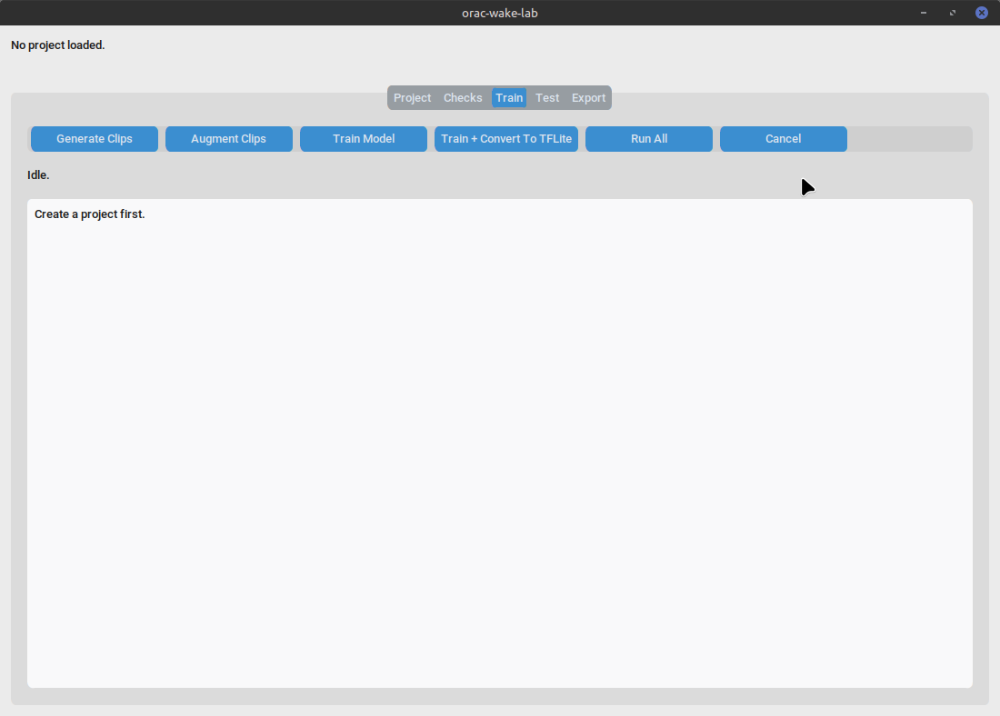
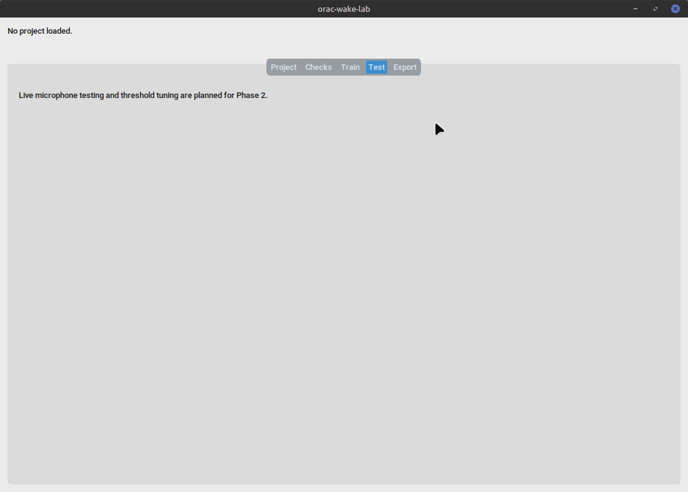
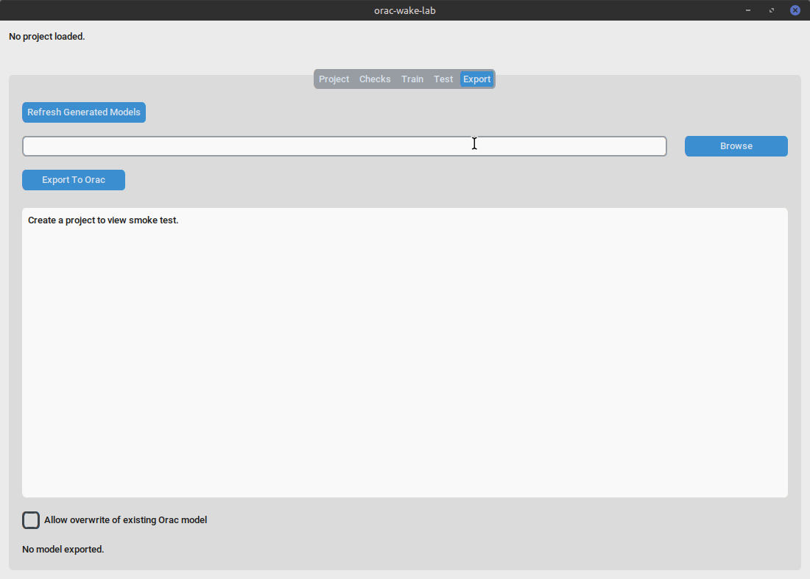

# Orac Wake Lab

Orac Wake Lab is a local workflow wrapper around openWakeWord. It does
not train a wake word by itself. Instead, it helps you:

- create a per-project workspace
- generate openWakeWord training configuration
- run openWakeWord training stages
- capture training logs
- mirror generated model artefacts
- export candidate models and Orac config snippets
- smoke-test the exported model against Orac

It is a desktop developer tool, not part of the main Orac runtime.

## Launch

From the Orac repository root:

```bash
poetry run python -m tools.orac_wake_lab.app
```

If you are elsewhere:

```bash
cd /home/clive/PycharmProjects/Orac
poetry run python -m tools.orac_wake_lab.app
```

The UI requires a graphical session and `customtkinter`.

## Overview

Wake Lab is a convenience layer around the openWakeWord training
workflow. It does not implement wake-word training logic itself. The
application:

- stores project settings in a local workspace
- validates local paths and dependencies
- writes the training configuration expected by openWakeWord
- launches the openWakeWord training stages as subprocesses
- copies generated `.onnx` or `.tflite` artefacts into the Orac repo
- writes a candidate Orac voice configuration snippet
- prints the Orac smoke-test command for the exported model

## Concepts

These terms are specific to the Wake Lab workflow.

- **Wake phrase**: the phrase you want Orac to respond to, for example
  `Hey Orac`.
- **Model name**: the filesystem-safe name derived from the wake phrase
  and used for workspace and model files, for example `hey_orac`.
- **openWakeWord repository path**: the root of a local cloned
  openWakeWord checkout. Wake Lab expects a repository layout that
  contains `openwakeword/train.py`.
- **Piper sample generator path**: the root of a local
  `piper-sample-generator` checkout. Wake Lab expects this path to
  contain `generate_samples.py`.
- **Piper voice/model**: the Piper voice assets used by openWakeWord to
  synthesise spoken examples of the wake phrase during training.
- **Background audio**: directories containing ambient audio to mix into
  generated training samples.
- **Room impulse responses, RIR**: recordings of room acoustics used to
  make training samples sound more like real microphone capture.
- **Negative feature `.npy` files**: the standard bundle of preprocessed
  feature arrays that teach openWakeWord what normal background speech,
  noise, and music look like. Wake Lab expects these files to already
  exist and points training at them.
- **False-positive validation `.npy` file**: the preprocessed feature
  file used to check how often the model triggers when it should not.
  Wake Lab expects this to already exist as a `.npy` file, not as a raw
  audio clip.
- **ONNX model**: an exported model format that Wake Lab can copy into
  Orac.
- **TFLite model**: an alternative exported model format that Wake Lab
  can also copy into Orac.
- **Threshold**: the activation threshold used by Orac when it loads the
  exported wake-word model.
- **Candidate Orac config snippet**: the generated INI fragment that
  points Orac at the exported model.
- **Smoke test**: the Orac command used to confirm that the exported
  model activates correctly.

## What are .npy feature files?

`.npy` files are NumPy binary data files. In Wake Lab, they are not
audio recordings. They are numerical arrays created by preprocessing
audio first, and openWakeWord uses those arrays during training.

The practical difference is:

- Raw audio files such as `.wav`, `.mp3`, and `.flac` contain sound.
- Preprocessed `.npy` feature files contain numbers derived from that
  sound after feature extraction.

Wake Lab currently expects those `.npy` files to already exist. You
normally do not open or edit them manually. Instead, you point Wake Lab
at the files produced by the training or preprocessing workflow.

## Feature bundle bootstrap

Wake Lab ships with a first-run workflow for the standard openWakeWord
feature bundle so you do not need to chase down feature files by hand.
The bundle lives in the managed WakeLab home under:

- `~/WakeLab/data/features/negative/openwakeword_features_ACAV100M_2000_hrs_16bit.npy`
- `~/WakeLab/data/features/validation/validation_set_features.npy`

These are `.npy` files, not audio recordings. The negative file is the
large one, about 17 GB, and the validation file is much smaller.

On the **Project** tab, Wake Lab can:

- Detect Feature Bundle: check whether the managed files are already in
  place and use them automatically
- Register Existing Feature Bundle: copy files you already have into the
  managed WakeLab folders
- Open Feature Folder: open the managed feature directory in your file
  manager
- Download Standard Feature Bundle: fetch the official bundle from
  `davidscripka/openwakeword_features` on Hugging Face

Simple mode uses the managed bundle automatically when it is present.
Advanced users can still browse to their own `.npy` files and override
the managed locations manually.

## Prerequisites

Separate the prerequisites into two groups:

### UI prerequisites

These are needed to launch the Wake Lab window.

- Linux desktop session
- Orac repository checkout
- Orac Poetry environment
- `customtkinter`

The UI should still be launchable even when the training inputs are not
ready. Missing training data should block training tabs, not the app
itself.

### Training prerequisites

These are needed for a useful training run.

- openWakeWord repository checkout cloned locally
- openWakeWord training dependencies
- Piper sample generator repository cloned locally
- Piper voice or generator model
- background audio directories
- RIR directories
- negative feature `.npy` files
- false-positive validation `.npy` file

The app does not download datasets for you.

Example clone commands:

```bash
git clone https://github.com/dscripka/openWakeWord
git clone https://github.com/rhasspy/piper-sample-generator
```

## What is the Piper generator path?

The Piper generator path is the location of the `piper-sample-generator`
repository clone that openWakeWord uses to synthesise training clips.

Current Wake Lab behaviour expects the configured path to point at the
root of a cloned repository that contains `generate_samples.py`. The
dependency check code prepends that directory to `sys.path`, imports
`generate_samples`, and confirms that the module exposes a
`generate_samples()` function.

In practical terms, this means the field should usually point to the
repository root of a cloned checkout, not to an installed package
directory.

Example verification:

```bash
test -f /path/to/piper-sample-generator/generate_samples.py
```

or, if you prefer to check from Python:

```bash
python - <<'PY'
from pathlib import Path
path = Path("/path/to/piper-sample-generator")
print((path / "generate_samples.py").exists())
PY
```

The openWakeWord notebook and training example both follow this style of
workflow by referring to a local `piper-sample-generator` checkout.

### Known limitation

Wake Lab currently validates the path by looking for
`generate_samples.py` and importing `generate_samples` from that
directory. If your local Piper layout differs, the app will treat it as
unusable.

## Managed Wake Lab home

Wake Lab treats `~/WakeLab` as a managed home directory for
conventional locations. You can override this location by setting the
environment variable:

```bash
export WAKE_LAB_HOME=/path/to/your/custom/home
```

Within the Wake Lab home, the following conventional layout is used:

```text
~/WakeLab/
  projects/               # Individual wake-word project workspaces
  data/
    background/           # Ambient audio recordings for augmentation
    rir/                  # Room Impulse Response files
    features/
      negative/           # Precomputed negative feature .npy files
      validation/         # False-positive validation .npy files
  external/
    openWakeWord/         # Local openWakeWord repository checkout
    piper-sample-generator/ # Local piper-sample-generator checkout
  downloads/              # Temporary download location
  cache/                  # Application cache
```

### Initialise Wake Lab folders

You can automatically create this directory structure from the **Project**
tab by clicking **Initialise Wake Lab folders**.

This action only creates the empty directories. It does not:
- clone repositories
- download datasets
- download feature files
- modify your Orac configuration

Empty managed folders are expected until you supply the corresponding
training data or external tools.

## Simple mode versus advanced mode

Wake Lab defaults simplify where things live by pre-filling paths and
discovering files within the managed home directory.

- **Simple mode**: Follow the managed conventions. Put your data and
  tools in `~/WakeLab` and the app will auto-fill most fields.
- **Advanced mode**: Override any path in the **Project** tab. You can
  point to data anywhere on your filesystem.

Once a final model is exported, Orac only needs the exported model file
and the Orac config entry at runtime. The training data and project
workspaces are only needed for retraining or audit.

## What is temporary?

- **Downloads**: Files in `~/WakeLab/downloads` can be deleted after
  extraction.
- **Cache**: `~/WakeLab/cache` is for temporary application state.
- **Project logs**: `logs/` inside a project workspace are for debugging
  training.

## What is required by Orac at runtime?

Orac only requires the final exported wake-word model (usually a
`.tflite` or `.onnx` file) and the matching configuration in
`resources/config/orac.ini`.

You do **not** need the following to run Orac:
- `openWakeWord` repository
- `piper-sample-generator` repository
- background audio or RIR datasets
- negative feature files
- Wake Lab project workspaces

## What should be kept for retraining?

To retrain or fine-tune a model later, you should keep:
- the project workspace (especially `project.json`)
- the exact datasets (background, RIR) used
- the negative feature files used

Retaining these ensures that your next training run is consistent with
the previous one.

## First-run checklist

From a fresh checkout:

1. Confirm the Orac venv exists and is usable.
2. Install the Wake Lab UI dependency:

   ```bash
   poetry add customtkinter
   ```

3. Launch the app:

   ```bash
   poetry run python -m tools.orac_wake_lab.app
   ```

4. In the **Project** tab, click **Initialise Wake Lab Folders**.
5. Supply your training data (background, RIR, features) to the newly
   created folders under `~/WakeLab/data/`. The `negative/` and
   `validation/` feature folders expect `.npy` files, not ordinary audio
   recordings. For a first run, use the feature-bundle actions in the
   **Project** tab rather than hunting for files manually.
6. Clone the external tools if missing:
   ```bash
   cd ~/WakeLab/external
   git clone https://github.com/dscripka/openWakeWord
   git clone https://github.com/rhasspy/piper-sample-generator
   ```
7. Create or load a project in the **Project** tab. The app will
   auto-detect the data and tools you just supplied.
8. Run **Checks** to confirm the local training prerequisites.
9. Use **Train** to generate clips, augment, and train the model.
10. Use **Export** to mirror the model into Orac and produce the smoke
    test command.

## Example workflow

This is an example workflow using the phrase `Hey Orac`. It is a guide
for moving through the app, not a guarantee that all training
prerequisites are already installed or that the resulting model will be
good simply because training completes.

1. Launch Orac Wake Lab from the Orac repository:

   ```bash
   cd /home/clive/PycharmProjects/Orac
   poetry run python -m tools.orac_wake_lab.app
   ```

2. Open the `Project` tab and create a new project.
3. Enter the wake phrase `Hey Orac`.
4. Confirm, or edit, the derived model name so it is `hey_orac`.
5. Set the openWakeWord repository path to your local checkout.
6. Set the Piper sample generator path to your local
   `piper-sample-generator` checkout.
7. Select the background audio directories, RIR directories, negative
   feature `.npy` files, and the false-positive validation `.npy` file.
8. Run the `Checks` tab and review the results before training.
9. Return to `Project` if needed and generate or refresh the training
   YAML.
10. Open the `Train` tab and run the stages in order:

    - Generate Clips
    - Augment Clips
    - Train Model
    - Train + Convert To TFLite

11. Review the log output if any stage fails. The logs should show which
    subprocess or dependency caused the problem.
12. Open the `Export` tab and confirm that a generated `.onnx` or
    `.tflite` model has been detected.
13. Export the model to Orac.
14. If appropriate, copy the candidate config snippet into Orac's live
    config manually. Wake Lab does not edit Orac's live config for you.
15. Run the smoke-test command shown by the export tab:

    ```bash
    PYTHONPATH=src poetry run python -m orac_voice.voice_loop_local \
      --voice-session --activation-mode openwakeword
    ```

This example only covers the mechanics of using the app. The exported
model still needs real-world testing for false positives and false
negatives before it should be treated as ready.

## Tab guide

Each tab has a screenshot in [`images/`](images/).

### Project tab



This tab creates or updates a wake-word project workspace.

Widgets:

- **Wake phrase**: the phrase to train, for example `Hey Orac`.
- **Model name**: the filesystem-safe model identifier derived from the
  wake phrase.
- **Derive**: regenerates the model name from the wake phrase.
- **Workspace root**: top-level directory where Wake Lab stores the
  project workspace.
- **Piper sample generator location**: the local `piper-sample-generator` root.
- **Background audio dirs**: comma-separated directories containing ambient
  audio for training.
- **RIR dirs**: comma-separated room impulse response directories.
- **Negative feature .npy files**: comma-separated feature files used
  for negative examples.
- **False-positive validation .npy**: the validation feature file.
- **Negative phrases**: extra phrases to treat as near-misses during
  training.
- **Profile**: training preset selector (`quick`, `balanced`, or
  `manual`).
- **Browse** buttons: pick directories or files for the corresponding
  fields.
- **Create / Save Project**: creates the workspace, writes project
  metadata, and generates the training config.
- **Initialise Wake Lab Folders**: creates the conventional managed
  directory structure under `~/WakeLab`.
- **Status**: shows validation messages and save confirmation.

### Checks tab



This tab runs local dependency and path validation for the active
project.

Widgets:

- **Run Checks**: executes the dependency checks in a background thread.
- **Output textbox**: shows each validation result, its message, and the
  stage blocks it affects.

### Train tab



This tab launches the openWakeWord training stages.

Widgets:

- **Generate Clips**: runs the clip-generation stage.
- **Augment Clips**: runs the augmentation stage.
- **Train Model**: runs training without TFLite conversion.
- **Train + Convert To TFLite**: runs training and exports a TFLite
  model.
- **Run All**: runs the supported stages in sequence.
- **Cancel**: stops the current subprocess job.
- **Status label**: shows the active stage and job state.
- **Log textbox**: shows live subprocess output.

### Test tab



This tab tests a trained ONNX wake-word model against a selected WAV
file. It is intended as the first diagnostic path before live microphone
testing: use it to confirm that the model activates on known positive
clips and stays below threshold on non-wake-word audio.

Widgets:

- **Model**: path to the trained `.onnx` model. **Refresh Model**
  fills this from the current project, usually
  `openwakeword_output/<model_name>.onnx`.
- **Model Browse**: selects an ONNX model manually.
- **WAV**: path to the WAV file to evaluate.
- **WAV Browse**: selects a WAV file manually. Project-generated
  positive and negative clips are useful first test files.
- **Threshold**: score cutoff for reporting activation. The default is
  `0.75`.
- **Run WAV Test**: loads the model, runs the WAV through
  openWakeWord, and reports the highest score.
- **Copy To Clipboard**: copies the diagnostic output for support or
  comparison.
- **Output textbox**: shows the model path, WAV path, model output
  name, number of frames evaluated, maximum score, threshold, and
  activation result.

Typical checks:

1. Test one generated positive clip from
   `openwakeword_output/<model_name>/positive_train/`. The result should
   usually be `ACTIVATED`.
2. Test one generated negative clip from
   `openwakeword_output/<model_name>/negative_train/`. The maximum score
   should ideally stay below the threshold.
3. Test real recordings of your voice saying and not saying the wake
   phrase before relying on the model in Orac.

### Export tab



This tab copies a trained model into the Orac repository and generates
the matching config snippet.

Widgets:

- **Refresh Generated Models**: scans the project output directory for
  `.onnx` and `.tflite` files and mirrors them into the project model
  directory.
- **Model path entry**: the selected model file to export into Orac.
- **Browse**: opens a file picker for selecting a model manually.
- **Export To Orac**: copies the selected model into
  `var/models/wake/` and writes the candidate config snippet.
- **Output textbox**: shows the exported model path, generated config
  snippet, and smoke-test command.
- **Allow overwrite of existing Orac model**: permits replacing an
  existing target model after confirmation.
- **Status**: shows export status or failure messages.

## Exporting to Orac

The export tab copies a generated `.onnx` or `.tflite` model into:

```text
var/models/wake/
```

It also writes a candidate Orac config snippet that points
`openwakeword_model_paths` at the exported file.

The export step does not edit Orac's live config automatically. Apply
the snippet yourself if you want to use the exported model.

## Smoke test

After exporting a model, Wake Lab shows the Orac smoke-test command.
This is the command the app expects you to run from the Orac
repository:

```bash
PYTHONPATH=src poetry run python -m orac_voice.voice_loop_local \
  --voice-session --activation-mode openwakeword
```

Use that command to confirm the exported model activates correctly.

## Training caveats

- Changing the wake phrase means retraining.
- Threshold tuning is relatively cheap compared with retraining a new
  phrase.
- Training can take a long time.
- Dataset quality strongly affects false positives and false negatives.
- The app does not download datasets yet.
- The app does not edit Orac's live config.
- Live microphone testing is Phase 2.

## Troubleshooting

### CustomTkinter missing

Install it into the active Poetry environment:

```bash
poetry add customtkinter
```

### openWakeWord import fails

Check that the openWakeWord repository path points to a checkout that
contains `openwakeword/train.py`, and that the environment can import
`openwakeword` from that path.

### Piper generator path fails

Check that the path points to the root of a cloned
`piper-sample-generator` repository containing `generate_samples.py`.

### Negative feature `.npy` files missing

Add at least one precomputed negative feature file before running
training. The `Train` tab will block until one or more `.npy` files are
configured and readable.

### False-positive validation `.npy` missing

Provide a valid `.npy` validation feature file before training.

### TensorFlow / ONNX conversion dependency missing

Some stages and the TFLite conversion path depend on extra training
libraries. Run `Checks` to see which dependency is missing and which
training stage it blocks.

### Model export target already exists

The export tab refuses to overwrite an existing Orac model unless you
tick the overwrite box and confirm the replacement.

### Generated model not found

Use **Refresh Generated Models** after training, or confirm that the
openWakeWord output directory contains the expected `.onnx` or `.tflite`
file for your model name.

## Notes

- Wake Lab is separate from the main Orac voice assistant.
- It does not start Orac itself.
- It is intended as a local developer workflow for wake-word
  preparation and export.
